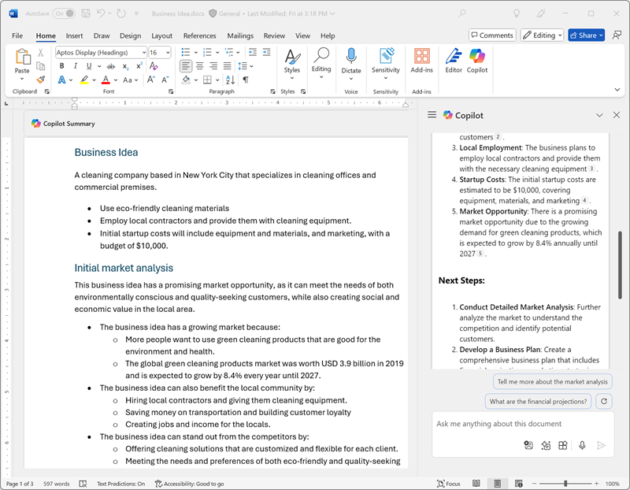

---
lab:
    title: 'Explore Microsoft 365 Copilot (Web Version)'
---
# Explore Microsoft 365 Copilot (Web Version)

Welcome to the exciting world of Microsoft 365 Copilot using the web-based Microsoft 365 applications!

In this exercise, you'll harness the power of Copilot to explore a new business idea: starting a corporate cleaning company using the web versions of Microsoft 365 applications.

Imagine this: you're about to launch a top-notch cleaning service that will revolutionize office spaces everywhere. With Microsoft Copilot by your side in the web applications, you'll research market trends and develop a solid business plan. But that's not all! You'll also create compelling documents, eye-catching presentations, and persuasive emails to help get your idea off the ground and attract investors.

Get ready to unleash your creativity and business acumen as you navigate through this engaging and interactive lab using Microsoft 365 on the web. By the end of this exercise, you'll have a comprehensive set of materials that will set you on the path to entrepreneurial success. Let's get started and make your corporate cleaning company a reality!

> **Important**: This exercise provides prompts that you can use to work with Copilot in the web versions of Microsoft 365 apps. You should use these as a *starting point* for your exploration of Copilot. You are encouraged to modify these prompts and add prompts of your own to engage in an iterative dialog with Copilot and refine the results it produces. You may not end with exactly the output that is described in the exercise instructions, but that's OK - the point is to experiment with Copilot.

This exercise should take approximately **40** minutes to complete.

> **Note**: This exercise requires a **Microsoft 365 Copilot** license and uses the web versions of Microsoft 365 applications.

## Getting Started with Microsoft 365 Web Apps

Before beginning the lab exercises, you'll need to access Microsoft 365 through the web. Use one of these primary entry points:

- **Main Portal**: [https://m365.cloud.microsoft/](https://m365.cloud.microsoft/) or [https://m365copilot.com](https://m365copilot.com)
- **All Apps**: [https://m365.cloud.microsoft/apps/](https://m365.cloud.microsoft/apps/)

You can also access individual applications directly using these links:
- **OneDrive**: [https://m365.cloud.microsoft/onedrive/](https://m365.cloud.microsoft/onedrive/)
- **Word**: [https://word.cloud.microsoft/](https://word.cloud.microsoft/)
- **Excel**: [https://excel.cloud.microsoft/](https://excel.cloud.microsoft/)
- **PowerPoint**: [https://powerpoint.cloud.microsoft/](https://powerpoint.cloud.microsoft/)
- **Outlook**: [https://outlook.office.com/](https://outlook.office.com/)

## Use Copilot to explore a document and research an idea

To start your exploration of generative AI, let's use Copilot for Word on the web to examine an existing document and extract some insights from it.

1. In a web browser, open the document [Business Idea.docx](https://github.com/MicrosoftLearning/mslearn-copilot/raw/main/Allfiles/Business%20Idea.docx) at `https://github.com/MicrosoftLearning/mslearn-copilot/raw/main/Allfiles/Business%20Idea.docx`. 
1. Download the file to your **Downloads** folder.
1. Navigate to **OneDrive** on the web at [https://m365.cloud.microsoft/onedrive/](https://m365.cloud.microsoft/onedrive/) and upload the **Business Idea.docx** document you just downloaded.
1. From your **OneDrive**, open **Business Idea.docx** in **Microsoft Word** on the web by navigating to [https://word.cloud.microsoft/](https://word.cloud.microsoft/) or by clicking on the document in OneDrive (closing any welcome messages or notifications of new features) and review the document, which describes some high-level ideas for a cleaning business in New York City. If prompted, select **Enable editing** at the top.

    > **Tip**: You can close the **Navigation** pane if it is open to see more of the document.

1. Find and select the **Copilot** icon on the Word web toolbar to open the Copilot pane, as shown here (your visual theme may vary):

    

1. In the Copilot pane, enter following the prompt in the text area at the bottom:

    ```prompt
    Summarize this document into 5 key points, and suggest next steps.
    ```

1. Review the response from Copilot, which should summarize the main points in the document, as shown here:

    

    > The specific response you receive may vary due to the nature of generative AI.

    Hopefully, Copilot has provided some useful guidance. However if you have additional questions, you can just ask for more specific information.

1. Return to the Copilot pane to ask Copilot the following question:

    ```prompt
    How do I setup a new business in New York? Answer with a numbered list.
    ```

1. Review the response and follow up with additional questions as needed. When you're happy with the response, copy it to the clipboard. Paste it into the Word document after the existing text. Then select the text that provides a list of things to do when setting up a business in New York and use the Copilot icon (at the bottom of the selected text) to visualize the text as a table.

    

1. Review the table and ask Copilot to add more information, such as a column with references for more details.  Your response should look something like this (you may need to use the **Regenerate** button):

    

    > **Important**: The AI-generated response is based on information publicly on the Web. While it may be useful to help you understand the steps required to set up a business, it is not guaranteed to be 100% accurate and does not replace the need for professional advice!

1. When you're happy with the table that Copilot has generated, select the option to **Keep it**.

## Use Copilot to create content for a business plan

Now that you've done some initial research, let's have Copilot help you develop a business plan for your cleaning company using Word on the web.

1. With the **Business Idea.docx** document still open in Word on the web, in the Copilot pane, enter the following prompt:

    ```prompt
    Can you suggest a name for my cleaning business?
    ```

1. Review the suggestions and select a name for your cleaning company (or continue prompting for more suggestions find a name you like).
1. Create a new blank document by navigating to [https://word.cloud.microsoft/](https://word.cloud.microsoft/) and selecting **New blank document**. Then, in the new document, select the Copilot icon in the margin to draft new content. Enter the following prompt, replacing **Contoso Cleaning** with the company name of your choice:

    ```prompt
    Write a business plan for "Contoso Cleaning" based on the information in /Business Idea.docx. Include an executive summary, market overview, and financial projections.
    ```

    

    > **Tip**: Type the prompt, and when you type "/" Copilot should enable you to browse the documents in your OneDrive folder. If Copilot does not suggest any documents, it may be because your OneDrive has not yet been fully indexed. In this case, modify the prompt to `Write a business plan for "Contoso Cleaning", a commercial cleaning business in New York. Include an executive summary, market overview, and financial projections.`.

1. Generate and review a response. Then keep it, adjust the tone, length, or ask Copilot to rewrite it with a new prompt. Apply appropriate headings and styling to your document to make it look professional before saving it as **Business Plan.docx** in your OneDrive folder. Your document should look something like this:

    

## Visualize financial projections in Copilot for Excel

With a business plan in hand, let's take some of that data on financial projections and ask Copilot in Excel on the web to visualize that data for us, so we can include it in emails or presentations to investors.

1. With the **Business Plan** document open in Microsoft Word on the web, open the Copilot pane.
1. If the business plan that was generated included a list of projected profits, enter the following prompt:

    ```prompt
    Create a table of the projected profits in this document.
    ```

    Otherwise, enter this prompt:

    ```prompt
    Create a table of projected profits for the next 5 years, starting with this year. The profit this year should be $10,000 and it should increase by 12% each year.
    ```

1. Copy the table of projected profits to the clipboard.
1. Open **Excel** on the web by navigating to [https://excel.cloud.microsoft/](https://excel.cloud.microsoft/) and create a new blank workbook. Immediately save the workbook as **Financial Projections.xlsx** to your OneDrive folder.
1. Paste the table of profit projections into the Excel spreadsheet and **format it as a table**. To do this:
    1. Select a **cell** within your data.
    1. Select **Home** and choose **Format as Table** under Styles. 
    1. Choose a style for your table.
    1. In the **Create Table** dialog box, confirm or set your cell range.
    1. Mark if your table has headers, and select **OK**.
1. With your sales projections formatted as a table, open the Copilot pane from the **Home** tab of the Excel web interface and enter the following prompt:

    ```prompt
    Suggest ways to visualize these financial projections.
    ```
    
1. Copilot should suggest a way to visualize your data and offer to add a pivot chart to a new sheet.

    

    > **Tip**: If Copilot suggests a different format for the data, enter the follow-on prompt `Visualize the data as a line chart.`.

1. Select the option in the Copilot response to add the pivot chart to a new sheet and open it. Select the chart and then select **Design** to apply styles, change the chart type and other actions. At the end, you should have something that resembles this:

    

1. Save the workbook and close the Excel web tab.

## Use Copilot to create content for a presentation

With Copilot's help, you've created a draft of a business plan for the cleaning business idea and prepared some financial projections. Now you'll need an effective presentation to communicate the benefits of your business using PowerPoint on the web.

1. Open **PowerPoint** on the web by navigating to [https://powerpoint.cloud.microsoft/](https://powerpoint.cloud.microsoft/) and create a new **blank presentation**. If the **Designer** pane opens automatically, close it.
1. Save the presentation as **Cleaning Company.pptx** in your OneDrive folder.
1. Select the **Copilot button** in the **Home tab** of the PowerPoint web interface, select **Create presentation about...**, then complete the prompt in the Copilot pane as follows:

    ```prompt
    Create a presentation about a corporate cleaning service named "Contoso Cleaning" in New York City. The presentation should include the benefits of using a professional cleaning business.
    ```
1. Review the presentation design, then select **Generate slides**.

    
1. Copilot will generate slides in the presentation.  The process may take several minutes and your output should look something like this with a different theme:

    

1. Select **Keep it**, then set your **view** to **normal** on the lower right of your PowerPoint web interface
    

1. Select the second-last slide in the presentation (before the final *Conclusion* slide if Copilot generated one). Then, in the Copilot pane, in the chat box, prompt to create a new slide using the prompt `Add a slide about the benefits of an eco-friendly approach to cleaning.`

    

1. Save the presentation and close the PowerPoint web tab.

## Use Copilot to arrange a funding meeting

You've created some collateral to help you get your business started. Now it's time to reach out to an investor seeking some startup funding using Outlook on the web.

1. Open **Outlook** on the web by navigating to [https://outlook.office.com/](https://outlook.office.com/), and on the title bar, use the **Copilot** icon to open the Copilot pane.
1. Switch to the **Calendar** page and change the view to **Work week**. If you don't already have any scheduled events in your calendar for this week, you can add a couple so that Copilot has some information to work with.
1. In the Copilot pane, enter the following prompt:

    ```
    What events do I have scheduled this week?
    ```

    Copilot should respond with a summary of your scheduled events for the week - helping you identify availability for a meeting with a bank manager to arrange startup funding.

1. Switch to the **Mail** page and create a new email, and fill in the **To** box with your own email address.
1. Select the option to **Draft with Copilot**:

    
    
1. Enter the following prompt to generate a draft email:

    ```prompt
    Write an email to a bank manager requesting a meeting to discuss funding for a commercial cleaning business. The email should be concise and the tone should be professional.
    ```

1. Use Copilot to refine the email content, and then select **Keep it** to finalize the message.

    

1. You can send the email to yourself if you wish!

## Challenge

Now you've seen how to use Microsoft 365 Copilot in the web applications to research ideas and generate content, why not try exploring further? 

Based on what you've learned in this exercise, try using Copilot in the web versions of Microsoft 365 apps to plan a meeting in which you'll propose the adoption of generative AI in your organization. Here are a few ideas to get you started:

- Research the benefits of generative AI and Microsoft Copilot for businesses, finding information about productivity benefits, cost-savings, and examples of organizations that have already successfully adopted AI.
- Create a discussion document using Word on the web that you can circulate as pre-reading before the meeting.
- Create a presentation using PowerPoint on the web that you can use to present your case, including data and visualizations to emphasize key elements of your pitch.
- Compose an email using Outlook on the web to tell your coworkers about the meeting and provide some context for it.

Be as inventive as you like, and explore how Copilot can help you by finding information, generating and refining text, creating images, and answering questions - all within the web-based Microsoft 365 environment.

## Conclusion

In this exercise, you've used [Microsoft 365 Copilot](https://www.microsoft.com/microsoft-365/enterprise/copilot-for-microsoft-365) in the web versions of Microsoft 365 applications to find information and generate content. Hopefully you've seen how using generative AI in a copilot can help with productivity and creativity, even when working entirely within web browsers. Microsoft 365 web apps enable you to bring the power of generative AI to your business data and processes while providing the flexibility to work from anywhere with internet access, ensuring a manageable, secure, cloud-based solution.